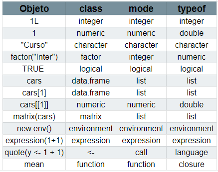
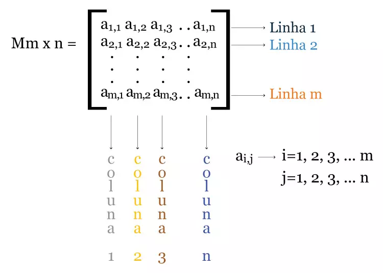
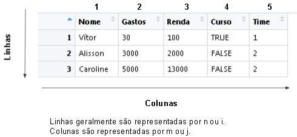
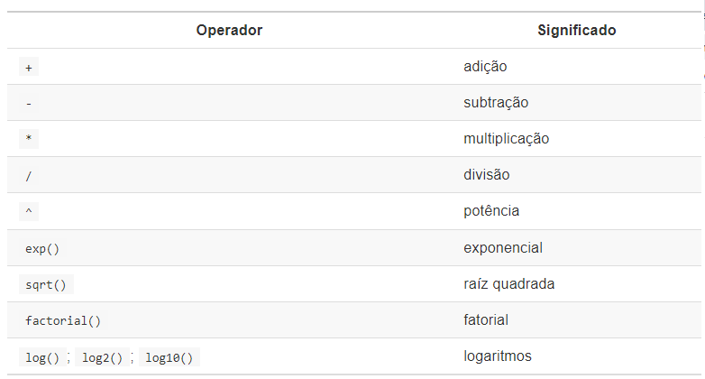

layout: true
  
<div class="my-footer"><span>

<a>Vítor Bernardo Silveira Pereira</a> - Email: <a href="mailto:vitorpereira3115@gmail.com">vitorpereira3115@gmail.com</a>
</span></div>

---
class: middle center bg-main1
```{r setup, include=FALSE}
options(htmltools.dir.version = FALSE)
knitr::opts_chunk$set(echo = FALSE, fig.align = "center", message=FALSE, warning=FALSE, cache = TRUE)

```


```{r}
library(knitr)
library(tidyverse)
library(widgetframe)
#library(interactingan)
#xaringan::inf_mr()
```
# Sumário
# `r emo::ji("zoom")`
---
class: middle
# Sumário 

### Entendendo a interface do R. Pode ser modificada?
### Como o R trabalha?
### Primeiro Script
### Atribuições e Objetos
### Importando Dados
### Tipos de objetos e Coerções de objetos
### Operadores Aritméticos: O R é uma grande calculadora!
### Primeiro Script e Salvando o Script

---
class: middle
# Interface do R 
```{r, out.width="80%"}
knitr::include_graphics("ide_rstudio.png")
```
---
class: middle
# Como o R Trabalha?

- Linguagem interpretada que utiliza principalmente C, mas também S, Fortran e C++;

- Armazenamento de arquivos de instalação descentralizado, o CRAN, vários computadores espalhados pelo mundo (inclusive no Brasil), com os arquivos, normalmente chamados de **Espelhos**;

- Três princípios:

  - Princípio do Objeto: Tudo que existe em R é um objeto;
  - Princípio da Função: Tudo que acontece no R é uma chamada de função;
---
class: middle

# Primeiro Script

- File > New File > R Script (Ctrl + Shift + N);
- Definindo caminho: Files > ... > Pasta > Set As Working Directory (setwd("Caminho da pasta"));
- Verificando o diretório atual: Files > More > Go To Working Directory (getwd());

---
class: middle
# Atribuições e Objetos

- **"O objeto não tem um nome, mas o nome tem um objeto"** (Wickham, 2019);
- O que é um objeto? É um **símbolo** ou **variável** capaz de armanezar dados ou uma estrutura de dados;
- O R é `case sensitive` e os nomes de objetos podem ser formados por letras, números, “_”, e “.”;
- Desde que não comecem por números ou pontos;
- Associar um objeto a um nome: "<-", "=", "->" e "assign".

---
class: middle
# Atribuições e Objetos
- Todos objetos em R tem uma classe: (Numeric, Logical, Character, Factor, List, Matrix, Array, Data Frame, ...);
- Suprimir o efeito da classe: `unclass()`;
- Começaremos trabalhando **Vetores atômicos** de comprimento 1, variáveis que armazenam apenas um tipo/classe de objeto  (também podemos chamar de escalar);
- Todo objeto tem dois atributos intrínsecos: modo e comprimento;
- Modo é a natureza do objeto.
- Comprimento mede a quantidade de elementos no objeto;

---
class: middle
# Classes básicos de dados

- Dados tem 5 classes básicas: Numérico, Lógico, Caracter, Complexo (complex) ou Bruto (raw);
- Mas temos 6 modos, a classe numérica pode ser double ou integer;
- Não utilizaremos objetos complex ou raw, no momento.
- Qual a diferença entre `class` e `typeof`
  - `class`: Informa qual a classe do objeto no R;
  - `typeof`: Informa como o objeto está sendo armazendo (como é interpretado na linguagem `C`);
  - `mode`: Informa a classe do objeto se baseando na linguagem `S`. 
- **OBS: **  Essas são as seis classes básicas, mas existem um número muito grande de classes, praticamente é inventanda uma classe nova todo dia com seu objetivo específico.

---
class: middle
# Tipos dos objetos
Comparação dos tipos de objetos pelas três funções `class()`, `mode()` e `typeoff()`:
```{r, out.width="80%"}

```

---
class: middle
# Coerção de tipos (classes)

- Em vetores atômicos com comprimento maior que 1 e tipos diferentes de objetos são misturados, temos a **coerção implícita**;
- No entanto, nós podemos forçar um objeto a mudar a sua classe com a **coerção explícita**;
- `as.integer`, `as.double`, `as.numeric`, `as.logical`, `as.logical`, `as.factor`, ...
- Também podemos verificar o tipo do objeto com `is.integer`, `is.logical`, ...


---
class: middle
# Importando Dados

- A entrada de dados no R pode ser realizada de diferentes formas. O formato mais adequado vai depender do tamanho do conjunto de dados, e se os dados já existem em outro formato para serem importados ou se serão digitados diretamente no R.

- Entrada de dados diretamente no R: `c()`, `rep()`, `seq()` ou `:`, `matrix()`, `list()` e `data.frame()`

- Entrada de via teclado: `scan()` e `readLines()`

- Entrada de arquivos via texto: `read.table()`, `read.csv()`, `read.csv2()` e `read.delim()`

- Comandos importantes: `head()`, `tail()`, `str()` e `summary()`

---
class: middle
# Funcionamento básico das estruturas de dados

As estruturas de dados no R e na programação em geral, são baseados nas matrizes matemáticas:

```{r, out.width="80%"}

```

---
class: middle
# Funcionamento básico das estruturas de dados

No R a estrutura de dados (bancos de dados) fica assim:

```{r, out.width="80%"}

```

---
class: middle
# O que é um fator?

- Uma classe construída a partir dos tipos básicos citados anteriormente, tendo características de caracter e inteiro;
- São parecidos com caracteres, mas tratados com inteiro;
- Características:
  - Coleção de categorias ou **níveis**;
  - Estrutura unidimensional;
- São tratados como inteiro, pois cada nível única é identificada internamente por um número;
- Faz com que os fatores possuam uma ordenação, de acordo com as categorias únicas;
- Caso haja uma hierarquia, os níveis dos fatores podem ser ordenados explicitamente através do argumento `levels` (Util?);
- **OBS**: Se o fator for utilizado com níveis numéricos, precisamos ter cuidado quando for empregar técnicas estatísticas, pois não há relação numérica entre os níveis, um nível identificado com o número 2, não tem o dobro de valor que o nível identificado com o número 1.

---
class: middle
# Operadores matemáticos 
Os principais operadores matemáticos do R são:
```{r, out.width="80%"}

```
    - OBS: Potência também pode ser feita com `**` (`2**2= 2^2`). 